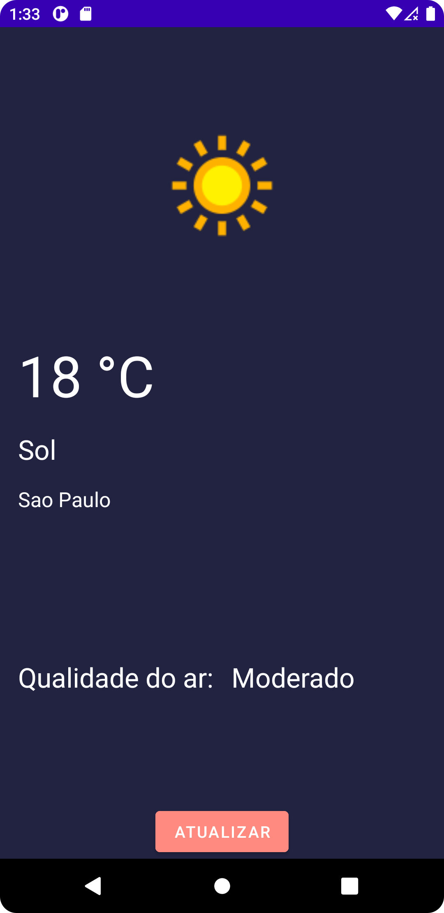

<h1 align="center">Projeto de clima
 
 
Projeto para ver o tempo de São paulo e sua qualidade do ar
</h1>

  

## About
Projeto simples mas com o intuito de colocar novos conhecimentos adquiridos atráves de estudos como clean architecture, Flow, Coroutines entre outros. 

## Development Roadmap
- [x] [Flow](https://developer.android.com/kotlin/flow?hl=pt-br)
- [x] [Clean architecture](https://developer.android.com/jetpack/guide?hl=pt-br)
- [x] [MVVM]((https://developer.android.com/jetpack/guide))
- [x] [Coroutines](https://developer.android.com/kotlin/coroutines?hl=pt-br)
- [ ] [Mockk](https://mockk.io/) 
- [ ] [Jetpack Compose](https://developer.android.com/jetpack/compose?gclsrc=ds&gclsrc=ds)
- [ ] Unit Tests

## Features
- [x] Tela inicial com o clima e a qualidade do ar
- [ ] Geolocalização
- [ ] Explicação sobre qualidade do ar
